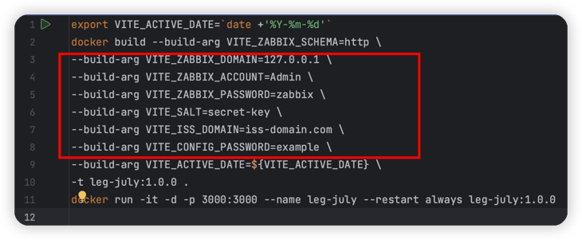
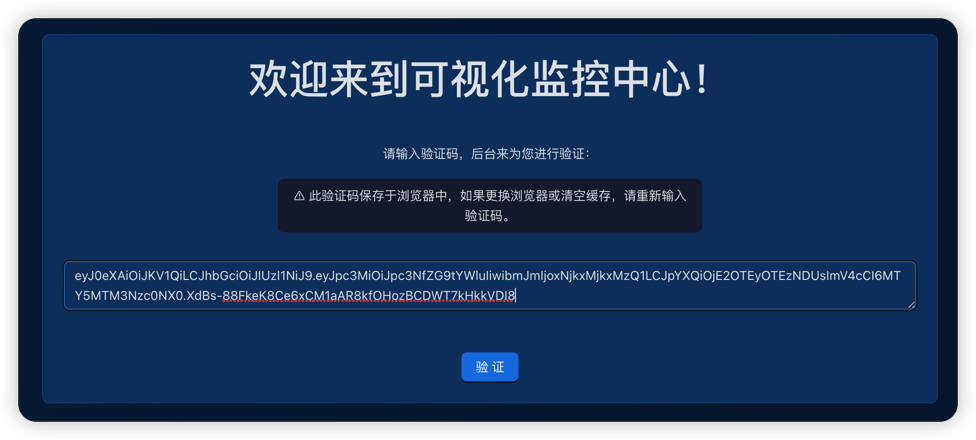

# Legendary July

# TODOs
- [x] 设计稿初版
- [x] Vue3 + [Ant-Design-Vue](https://antdv.com/components/overview-cn/) + [Echarts](https://echarts.apache.org/handbook/zh/get-started) Framework
- [ ] ...

# 部署
本地/授权端提供docker镜像，客户端拉取并启动docker容器。
## 本地端/授权端
### 前置条件
安装docker
### 步骤
1. 根据对应信息修改`start.sh`文件中变量，VITE_SALT与VITE_ISS_DOMAIN需要与`scripts/generate-token.sh` 使用的一致。
   > 注意，`VITE_SALT`不可使用纯数字

    
2. 通过根目录`start.sh`文件，构建镜像
    ```shell
    sh start.sh
    ```
3. 将docker镜像提供给客户

## 客户端
### 在最开始输入授权端提供的token



# 授权
### 本地生成JSON web token
参数：
- secret string: 用来加密的密文
- expire days: 多长时间失效
- iss domain: 代表token发行方的字符串，用来验证发行方
```shell
sh scripts/generate-token.sh [secret string] [expire days] [iss domain]
```

### 本地验证JSON web token
参数：
- token: 待测试的token值
- secret string: 用来加密的密文
```shell
sh scripts/verify-token.sh [secret string] [token]
```


